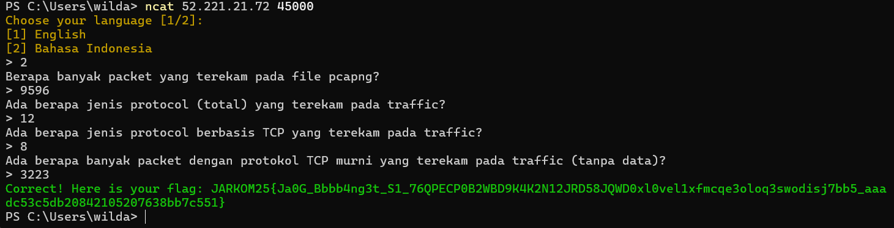
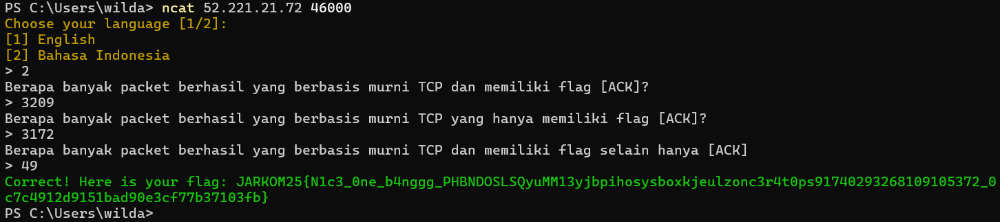
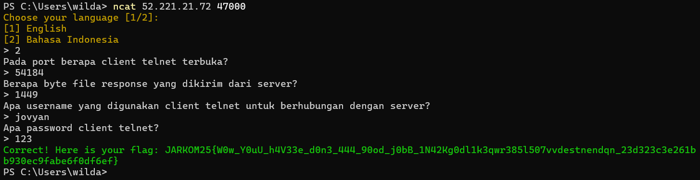
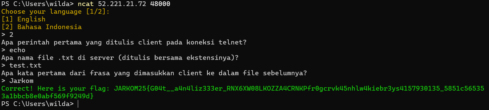
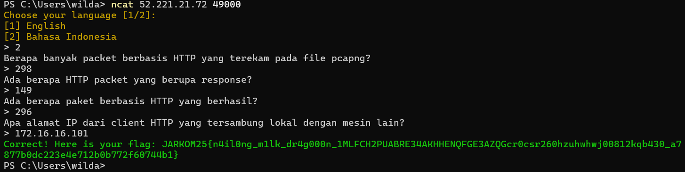
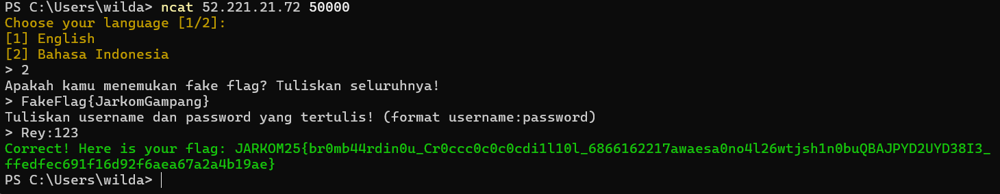
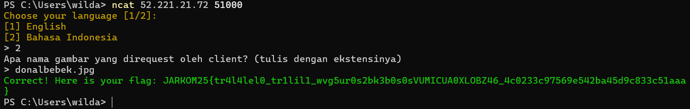
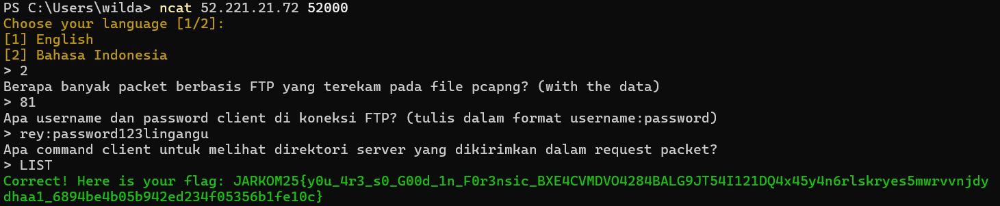
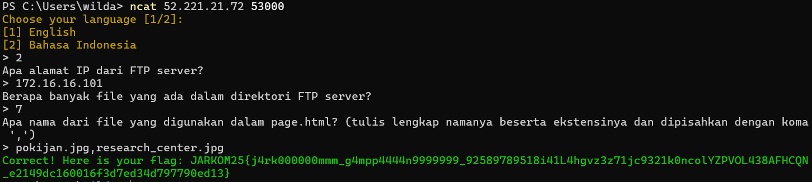
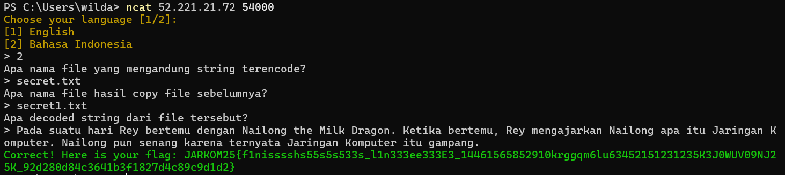

[](https://classroom.github.com/a/DGhYuEuO)
| Name | NRP | Class |
| ---- | --- | ----- |
| A. Wildan Kevin Assyauqi  | 5025241265 | Jaringan Komputer (A) |

## Task 1

- Flag

```shell
JARKOM25{Ja0G_Bbbb4ng3t_S1_76QPECP0B2WBD9K4K2N12JRD58JQWD0xl0vel1xfmcqe3oloq3swodisj7bb5_aaadc53c5db20842105207638bb7c551}
```

> a. Berapa banyak packet yang terekam pada file pcapng?

**Answer:** 
```
9596
```

- Filter expression

  **Tidak memerlukan** `filter` apapun untuk soal ini

- Explanation

  Menggunakan `capture file properties` dan melihat jumlah paket yang terekam, yaitu `9596` untuk file `soal1234.pcapng`

- Output result
  - Wireshark
      
  - Terminal
    


<br>
<br>

> b. Ada berapa jenis protocol (total) yang terekam pada traffic?


**Answer:** 
```
12
```

- Filter expression

  **Tidak memerlukan** `filter` apapun untuk soal ini

- Explanation

  Dengan cara memanfaatkan `Statistics->Protocol Hierarchy` dan menghuitung berapa banyak protokol berbeda yang muncul, di mana pada file `soal1234.pcapng` terdapat `12` protokol yang muncul, yaitu: `Frame`, `Linux cooked-mode capture`, `Internet Protocol Version 4`, `Transmission Control Protocol`, `Virtual Network Computing`, `Data`, `Telnet`, `Hypertext Transfer Protocol`, `JavaScript Object Notation`, `Thrift Protocol`, `Signaling Compression`, `HiPerConTracer Trace Service`

- Output result
  - Wireshark
      
  - Terminal
    

<br>
<br>

> c. Ada berapa jenis protocol berbasis TCP yang terekam pada traffic?

**Answer:** 
```
8
```

- Filter expression

  **Tidak memerlukan** `filter` apapun untuk soal ini

- Explanation

  Dengan cara memanfaatkan `Statistics->Protocol Hierarchy` dan menghitung berapa banyak protokol yang berada di bawah `TCP (Transmission Control Protocol)`  yang muncul. Di mana pada file `soal1234.pcapng` terdapat `8` protokol yang muncul, yaitu: `Virtual Network Computing`, `Data`, `Telnet`, `Hypertext Transfer Protocol`, `JavaScript Object Notation`, `Thrift Protocol`, `Signaling Compression`, `HiPerConTracer Trace Service`

- Output result
  - Wireshark
      
  - Terminal
    

  <br>
  <br>

> d. Ada berapa banyak packet dengan protokol TCP murni yang terekam pada traffic (tanpa data)?

**Answer:** 
```
3223
```

- Filter expression
  ```shell
  tcp.len == 0
  ```

- Explanation

  Filter `tcp.len == 0` digunakan di Wireshark untuk menampilkan semua paket TCP yang tidak membawa data (payload kosong). Di mana `len == 0` di sini menunjukkan yang panjangnya tepat 0 (tanpa data) dan `tcp` untuk mem-filter hanya protokol TCP. Namun, sesuai yang ada pada displayed bahwa angka yang muncul adalah `3222` namun saat saya memasukkan angka tersebut di terminal saya mendapatkan _wrong answer_. Kemudian saya memasukkan angka yang mendekati, salah satu-nya adalah `3223` dan jawaban tersebut benar, jujur saya juga kurang faham mengapa yang benar adalah `3223` dan bukan `3222`

- Output result
  - Wireshark
    
  - Terminal
    


## Task 2

- Flag

  ```shell
  JARKOM25{N1c3_0ne_b4nggg_PHBNDOSLSQyuMM13yjbpihosysboxkjeulzonc3r4t0ps91740293268109105372_0c7c4912d9151bad90e3cf77b37103fb}
  ```
> a. Berapa banyak packet berhasil yang berbasis murni TCP dan memiliki flag [ACK]?

**Answer:**
```
3209
```

- Filter expression

  ```
  tcp.len == 0 && tcp.flags.ack == 1
  ```

  melihat invalid packet (Bad-TCP)
  ```shell
  tcp.analysis.flags && !tcp.analysis.window_update && !tcp.analysis.keep_alive && !tcp.analysis.keep_alive_ack
  ```

- Explanation

  Sama seperti `task 1 point d` Filter `tcp.len == 0` digunakan untuk mem-filter TCP yang murni dan selanjutnya menggunakan operator `AND` atau `&&` untuk syarat ke-dua, yaitu `tcp.flags.ack == 1` untuk mem-filter hanya yang memiliki flag [ACK]. Namun, apabila kita menerapkan filter tersebut, filter sebenarnya memunculkan angka `3210`, dan apabila dimasukkan angka `3210` maka akan menghasilkan _wrong answer_, namun ada 1 yang invalid (yaitu kolom hitam yang ditampilkan di gambar) dikarenakan merupakan `Bad-TCP`, sehingga nilai pasti untuk packet berhasil yang berbasis murni TCP dan memiliki flag [ACK] adalah `3209` di dapat dari `3210-1`.

- Output result
  - Wireshark
    
  - Terminal
    

  <br>
  <br>

> b. Berapa banyak packet berhasil yang berbasis murni TCP yang hanya memiliki flag [ACK]?

**Answer:** 
```
3172
```

- Filter expression

  ```
  tcp.len == 0 && tcp.flags == 0x10
  ```

  melihat invalid packet (Bad-TCP)
  ```shell
  tcp.analysis.flags && !tcp.analysis.window_update && !tcp.analysis.keep_alive && !tcp.analysis.keep_alive_ack
  ```
  
- Explanation

  Hampir sama seperti soal sebelumnya, namun bedanya kali ini **hanya** yang memiliki flag [ACK] tidak disertai flag yang lain. Perbedaan terdapat pada sintaks `tcp.flags == 0x10` yang berguna untuk menampikan packets yang hanya memiliki flag [ACK] saja. Namun, apabila kita menerapkan filter tersebut, filter sebenarnya memunculkan angka `3174`, dan apabila dimasukkan angka `3184` maka akan menghasilkan _wrong answer_, namun ada 2 yang invalid dikarenakan merupakan `Bad-TCP`, sehingga nilai pasti untuk packet berhasil yang berbasis murni TCP yang hanya memiliki flag [ACK] adalah `3172` di dapat dari `3174-2`.

- Output result
  - Wireshark
    
  - Terminal
    
  
  <br>
  <br>

> c. Berapa banyak packet berhasil yang berbasis murni TCP dan memiliki flag selain hanya [ACK]?


**Answer:** 
```
49
```

- Filter expression
```
tcp.len == 0 && !(tcp.flags == 0x10)
```

- Explanation

  Sama seperti soal sebelumnya, hanya untuk kali ini merupakan kebalikannya, jika sebelumnya adalah **hanya** [ACK], untuk soal ini meminta **selain hanya** [ACK], sehingga memanfaatkan sintaks `NOT` atau `!` untuk memberikan negasi pada `(tcp.flags == 0x10)` untuk memberikan nilai **selain**. Namun, sesuai yang ada pada displayed bahwa angka yang muncul adalah `48` namun saat saya memasukkan angka tersebut di terminal saya mendapatkan _wrong answer_. Kemudian saya memasukkan angka yang mendekati, salah satu-nya adalah `49` dan jawaban tersebut benar, jujur saya juga kurang faham mengapa yang benar adalah `49` dan bukan `48`

- Output result
  - Wireshark
    
  - Terminal
    
    
  <br>
  <br>

## Task 3

- Flag
  ```
  JARKOM25{WOw_YOuU_h4V33e_d0n3_444_90od_j0bB_1N42Kg0dl1k3qwr3851507vvdestnendqn_23d323c3e261bb930ec9fabe6f0df6ef}
  ```

> a. Pada port berapa client telnet terbuka?

**Answer:**
```
54184
```

- Filter expression
```
telnet
```

- Explanation

  Menggunakan filter `telnet` untuk menampilkan packets dengan port telnet saja, lalu klik salah satu packet tersebut, dan cari info mengenai `Transmission Control Protocol, ...` maka pada info tersebut akan menampilkan informasi client port. Untuk kali ini port yang muncul adalah `54184`

- Output result
  - Wireshark
    
  - Terminal
    

  <br>
  <br>

> b. Berapa byte file response yang dikirim dari server?

**Answer:**
```
1449
```

- Filter expression
```
telnet
```

- Explanation

  Menggunakan filter `telnet` untuk menampilkan packets dengan port telnet saja, lalu klik salah satu packets yang muncul. Lalu pilih opsi `Follow -> TCp Stream`. Selanjutnya ubah dropdown pada kiri-bawah menjadi yang ke-dua. Maka byte yang tertera merupakan byte file response yang dikirim dari server, yaitu `1449`.

- Output result
  - Wireshark
    
  - Terminal
    
    
  <br>
  <br>

> c. Apa username yang digunakan client telnet untuk berhubungan dengan server?

**Answer:**
```
jovyan
```

- Filter expression
```
telnet
```

- Explanation

  Menggunakan filter `telnet` untuk menampilkan packets dengan port telnet saja, lalu klik salah satu packets yang muncul. Lalu pilih opsi `Follow -> TCp Stream`. Lalu perhatikan isi tersebut, pada bagian setelah `login:`. Perhatikan warna merah (karena merupakan input) Maka di situ akan menunjukkan username yang digunakan. Pada konteks ini username yang digunakan adalah `jovyan`.

- Output result
  - Wireshark
    
  - Terminal
    
    
  <br>
  <br>

> d. Apa password client telnet?

**Answer:**
```
123
```

- Filter expression
```
telnet
```

- Explanation

  Menggunakan filter `telnet` untuk menampilkan packets dengan port telnet saja, lalu klik salah satu packets yang muncul. Lalu pilih opsi `Follow -> TCp Stream`. Lalu perhatikan isi tersebut, pada bagian setelah `Password:`. Perhatikan warna merah (karena merupakan input) Maka di situ akan menunjukkan passsword yang digunakan. Pada konteks ini password yang digunakan adalah `123`.

- Output result
  - Wireshark
    
  - Terminal
    
    
  <br>
  <br>

## Task 4

- Flag
```
JARKOM25{G04t __ a4n4liz333er_RNX6XW08LKOZZA4CRNKPfr0gcrvk45nhlw4kiebr3ys4157930135_5851c565353a1bbcb8e0abf569f9249d}
```

> a. Apa perintah pertama yang ditulis client pada koneksi telnet?

**Answer:**
```
echo
```

- Filter expression
```
telnet
```

- Explanation

  Menggunakan filter `telnet` untuk menampilkan packets dengan port telnet saja, lalu klik salah satu packets yang muncul, lalu `follow TCP Stream`, pada opsi dropdown di kiri, ubah menjadi `request` atau yang memiliki besar 269 bytes. Maka di sana akan tertera perintah pertama yang ditulis oleh client yaitu `echo`.

- Output result
  - Wireshark
    
  - Terminal
    

  <br>
  <br>

> b. Apa nama file .txt di server (ditulis bersama ekstensinya)?

**Answer:**
```
test.txt
```

- Filter expression
```
telnet
```

- Explanation

  Menggunakan filter `telnet` untuk menampilkan packets dengan port telnet saja, lalu klik salah satu packets yang muncul, lalu `follow TCP Stream`, pada opsi dropdown di kiri, ubah menjadi `response` atau yang memiliki besar 1449 bytes. Maka di sana akan tertera nama file dengan ekstensi txt di server yaitu `test.txt`.

- Output result
  - Wireshark
    
  - Terminal
    

  <br>
  <br>

> c. Apa kata pertama dari frasa yang dimasukkan client ke dalam file sebelumnya?

**Answer:**
```
Jarkom
```

- Filter expression
```
telnet
```

- Explanation

  Menggunakan filter `telnet` untuk menampilkan packets dengan port telnet saja, lalu klik salah satu packets yang muncul, lalu `follow TCP Stream`, pada opsi dropdown di kiri, ubah menjadi `request` atau yang memiliki besar 269 bytes. Maka di sana akan tertera perintah pertama yang ditulis oleh client yaitu `Jarkom`.

- Output result
  - Wireshark
  - Terminal
    

  <br>
  <br>

## Task 5

- Flag
```
JARKOM25{n4il0ng_m1lk_dr4g000n_1MLFCH2PUABRE34AKHHENQFGE3AZQGcr0csr260hzuhwhwj00812kqb430_a7877b0dc223e4e712b0b772f60744b1}
```

> a. Berapa banyak packet berbasis HTTP yang terekam pada file pcapng?

**Answer:** 
```
298
```

- Filter expression
```
http
```

- Explanation

  Menggunakan filter `http` untuk menampilkan packets berbasis HTTP lalu menggunakn `capture file properties` dan melihat jumlah paket yang terekam, yaitu `298`.

- Output result
  - Wireshark
    
  - Terminal
    

  <br>
  <br>

> b. Ada berapa HTTP packet yang berupa response?

**Answer:** 
```
149
```

- Filter expression
```
http.response
```

- Explanation

  Menggunakan filter `http` untuk menampilkan packets berbasis HTTP, ditambah dengan `.response` untuk menampilkan yang hanya berupa response. Lalu menggunakn `capture file properties` dan melihat jumlah paket yang terekam, yaitu `149`.

- Output result
  - Wireshark
    
  - Terminal
    

  <br>
  <br>

> c. Ada berapa paket berbasis HTTP yang berhasil?

**Answer:** 
```
296
```

- Filter expression
```
http
```
lebih spesifik untuk yang berhasil
```
http && !tcp.analysis.retransmission && !tcp.analysis.lost_segment && !tcp.analysis.duplicate_ack
```

- Explanation

  Menggunakan filter `http` untuk menampilkan packets berbasis HTTP, di mana terdapat `298` packets berbasis `http`, namun karena ada 2 yang invalid (yang kolom hitam) maka paket yang berhasil adalah `296`. Kita bisa juga menggunakan sintaks `http && !tcp.analysis.retransmission && !tcp.analysis.lost_segment && !tcp.analysis.duplicate_ack` untuk menampilkan hanya yang **berhasil saja** yaitu sebanyak `296` packets. 

- Output result
  - Wireshark
    
  - Terminal
    
    
  <br>
  <br>

> d. Apa alamat IP dari client HTTP yang tersambung lokal dengan mesin lain?

**Answer:**
```
172.16.16.101
```

- Filter expression
```
http.request
```

- Explanation

  Menggunakan filter `http.request` untuk menampilkan semua paket `HTTP` request yang dikirim client. Dari hasil filter, terlihat bahwa alamat Source pada paket HTTP adalah `172.16.16.101`, sedangkan alamat Destination adalah `172.16.16.1`. Karena `172.16.16.101` berada dalam rentang alamat privat (172.16.0.0 – 172.31.255.255), maka alamat tersebut merupakan alamat IP client HTTP yang tersambung secara lokal dengan mesin lain.

- Output result
  - Wireshark
    
  - Terminal
    

  <br>
  <br>

## Task 6

- Flag
```
JARKOM25{br0mb44rdin0u_Cr0ccc0c0c0cdi1l101_6866162217awaesa0no4126wtjsh1n0buQBAJPYD2UYD38I3_ffedfec691f16d92f6aea67a2a4b19ae}
```

> a. Apakah kamu menemukan fake flag? Tuliskan seluruhnya!

**Answer:**
```
FakeFlag{JarkomGampang}
```

- Filter expression
```
http contains "FakeFlag"
```

- Explanation

  Menggunakan filter `http contains "FakeFlag"` untuk menampilkan paket HTTP yang di dalam payload-nya terdapat string "FakeFlag". Setelah filter diterapkan, paket yang relevan ditampilkan. Kemudian dilakukan Follow TCP Stream untuk melihat isi data lengkap, dan dari sana terlihat fake flag yang terkirim dari server, yaitu `FakeFlag{JarkomGampang}`.

- Output result
  - Wireshark
    
  - Terminal
    

  <br>
  <br>

> b. Tuliskan username dan password yang tertulis! (format username:password)

**Answer:** 
```
Rey:123
```

- Filter expression
```
http contains "txt"
```

- Explanation

  Menggunakan filter `http contains "txt"` untuk menampilkan paket HTTP yang di dalam payload-nya terdapat file txt. Setelah filter diterapkan, paket yang relevan ditampilkan. Kemudian dilakukan Follow TCP Stream untuk melihat isi data lengkap pada paket dengan info `passwd.txt`, dan dari sana terlihat username dan password yang digunakan.

- Output result
  - Wireshark
    
  - Terminal
    

  <br>
  <br>

## Task 7

- Flag
```
JARKOM25{tr414lel0_tr1lil1_wvg5ur0s2bk3b0s0sVUMICUA0XLOBZ46_4c0233c97569e542ba45d9c833c51aaa}
```

> Apa nama gambar yang direquest oleh client? (tulis dengan ekstensinya)

**Answer:**
```
donalbebek.jpg
```

- Filter expression
```
http.request
```

- Explanation

  Menggunakan filter `http.request` untuk menampilkan seluruh paket HTTP request yang dikirim client ke server. Dari hasil filter, terlihat adanya permintaan `GET` pada salah satu paket dengan resource bernama `donalbebek.jpg`. Hal ini menunjukkan bahwa client melakukan request untuk mengambil file gambar tersebut dari server.

- Output result
  - Wireshark
    
  - Terminal
    

  <br>
  <br>

## Task 8

- Flag
```
JARKOM25{y0u_4r3_s0_G00d_1n_F0r3nsic_BXE4CVMDV04284BALG9JT54I121DQ4x45y4n6rlskryes5mwrvvn jdydhaa1_6894be4b05b942ed234f05356b1fe10c}
```

> a. Berapa banyak packet berbasis FTP yang terekam pada file pcapng? (with the data)

**Answer:**
```
81
```

- Filter expression
```
ftp || ftp-data
```

- Explanation

  Menggunakan filter `ftp` untuk menampilkan packets dengan port `ftp` saja, lalu tambahkan operator `OR` atau `||` dan gunakan filter `ftp-data` untuk menampilkan packets dengan port `ftp` dengan data. Maka akan muncul totaalnya yang dapat dilihat melalui `capture file properties`.

- Output result
  - Wireshark
    
  - Terminal
    

  <br>
  <br>

> b. Apa username dan password client di koneksi FTP? (tulis dalam format username:password)

**Answer:**
```
rey:password123lingangu
```

- Filter expression
```
ftp || ftp-data
```

- Explanation

  Menggunakan filter yang sama dengan sebelumnya, untuk menampilkan packets dengan port ftp, lalu klik salah satu packets yang muncul, lalu `follow TCP Stream`, pada opsi dropdown di kiri, ubah menjadi `request` atau yang memiliki besar `323 bytes`. Maka di sana akan tertera username dan password yang digunakan, yaitu `rey` sebagai username  dan `password123lingangu` sebagai password.

- Output result
  - Wireshark
    
  - Terminal
    

  <br>
  <br>

> c. Apa command client untuk melihat direktori server yang dikirimkan dalam request packet?

**Answer:**
```
LIST
```

- Filter expression
```
ftp || ftp-data
```

- Explanation

  Menggunakan filter yang sama dengan sebelumnya, untuk menampilkan packets dengan port ftp, lalu klik salah satu packets yang muncul, lalu `follow TCP Stream`, pada opsi dropdown di kiri, ubah menjadi `request` atau yang memiliki besar `323 bytes`. Maka di sana akan tertera command client untuk melihat direktori server yang dikirimkan dalam request packet, yaitu `LIST`.

- Output result
  - Wireshark
    
  - Terminal
    

  <br>
  <br>

## Task 9

- Flag
```
JARKOM25{j4rk000000mmm_g4mpp4444n9999999_92589789518i41L4hgvz3z71jc9321k0ncoLYZPVOL438AFHCQN_e2149dc160016f3d7ed34d797790ed13}
```

> a. Apa alamat IP dari FTP server?

**Answer:**
```
172.16.16.101
```

- Filter expression
```
ftp || ftp-data
```

- Explanation

  Menggunakan filter yang sama dengan sebelumnya, untuk menampilkan packets dengan port ftp, Dari hasil filter, terlihat bahwa alamat Source pada paket HTTP adalah `172.16.16.101`. Karena `172.16.16.101` berada dalam rentang alamat privat (172.16.0.0 – 172.31.255.255), maka alamat tersebut merupakan alamat IP client HTTP yang tersambung secara lokal dengan mesin lain.

- Output result
  - Wireshark
    
  - Terminal
    

  <br>
  <br>

> b. Berapa banyak file yang ada dalam direktori FTP server?
 
**Answer:**
```
7
```

- Filter expression
```
ftp-data
```

- Explanation

  Menggunakan filter `ftp-data` untuk menampilkan packets dengan port `ftp` dengan data saja. Lalu pilih opsi `Follow -> TCp Stream`. Maka di sana akan tertera file-file yang ada di direktori ftp server. Di mana di sana tertera 8 baris dengan 7 baris menyebutkan nama file, yaitu: `donalbebek.jpg`, `jakipon.png`, `mike.pdf`, `page.html`, `pokijan.jpg`, `research_center.jpg`, dan `secret.txt`.

- Output result
  - Wireshark
    
  - Terminal
    

  <br>
  <br>

> c. Apa nama dari file yang digunakan dalam page.html? (tulis lengkap namanya beserta ekstensinya dan dipisahkan dengan koma ',')

**Answer:**
```
pokijan.jpg,research_center.jpg
```

- Filter expression
```
ftp-data
```

- Explanation

  Menggunakan filter `ftp-data` untuk menampilkan packets dengan port `ftp` dengan data saja. Lalu pilih packets yang pada tab `info`-nya terdapat `page.html` lalu opsi `Follow -> TCp Stream`. Maka di sana akan tertera file-file yyang digunakan dalam page.html. Yaitu `pokijan.jpg` ,`research_center.jpg`.
  
- Output result
  - Wireshark
    
  - Terminal
    

  <br>
  <br>

## Task 10

- Flag
```
JARKOM25{f1nisssshs55s5s533s_l1n333ee333E3_14461565852910krggqm6lu63452151231235K3JOWUV09NJ25K_92d280d84c3641b3f1827d4c89c9d1d2}
```

> a. Apa nama file yang mengandung string terencode?

**Answer:**
```
secret.txt
```

- Filter expression
```
ftp-data
```

- Explanation

  Menggunakan filter `ftp-data` untuk menampilkan packets dengan port `ftp` dengan data saja. Lalu pilih opsi `Follow -> TCp Stream`. Maka di sana akan tertera file-file yang ada di direktori ftp server. Di mana terdapat 7 file, yaitu: `donalbebek.jpg`, `jakipon.png`, `mike.pdf`, `page.html`, `pokijan.jpg`, `research_center.jpg`, dan `secret.txt`. Apabila diamati, bahwa hanya 1 file dengan ekstensi `.txt`, karena ini soal meminta file yang mengandung string, maka normalnya string akan disimpan di file dengan ekstensi `.txt`. Karena hanya ada 1 file dengan ekstensi `.txt` yaitu `secret.txt`. Maka file itu-lah jawabannya.

- Output result
  - Wireshark
    
  - Terminal
    

  <br>
  <br>

> b. Apa nama file hasil copy file sebelumnya?

**Answer:**
```
secret1.txt
```

- Filter expression
```
ftp-data
```

- Explanation

  Menggunakan filter `ftp-data` untuk menampilkan packets dengan port `ftp` dengan data saja. Lalu apaila di-amati pada tab `info` di sana terdapat `RETR secret.tzt` yang artinya mendownload file `secret.txt`. Lalu selanjutnya ada `STOR secret1.txt` yang artinya adalah *client* meng-upload ulang atau artinya meng-`copy` file. Maka file hasil  copy-nya adalah `secret1.txt`.

- Output result
  - Wireshark
    
  - Terminal
    

  <br>
  <br>

> c. Apa decoded string dari file tersebut?

**Answer:**
```
Pada suatu hari Rey bertemu dengan Nailong the Milk Dragon. Ketika bertemu, Rey mengajarkan Nailong apa itu Jaringan Komputer. Nailong pun senang karena ternyata Jaringan Komputer itu gampang.
```

- Filter expression
```
ftp-data
```

- Explanation

  Menggunakan filter `ftp-data` untuk menampilkan packets dengan port `ftp` dengan data saja. Lalu apaila di-amati pada tab `info` di sana terdapat `secret.tzt`, Pilih salah satu yang mengandung `secret.txt` atau `secret1.txt` lalu pilih opsi `Follow -> TCp Stream`. Maka di sana akan ada string yang ter-enkripsi, yaitu:
```
UGFkYSBzdWF0dSBoYXJpIFJleSBiZXJ0ZW11IGRlbmdhbiBOYWlsb25nIHRoZSBNaWxrIERyYWdvbi4gS2V0aWthIGJlcnRlbXUsIFJleSBtZW5nYWphcmthbiBOYWlsb25nIGFwYSBpdHUgSmFyaW5nYW4gS29tcHV0ZXIuIE5haWxvbmcgcHVuIHNlbmFuZyBrYXJlbmEgdGVybnlhdGEgSmFyaW5nYW4gS29tcHV0ZXIgaXR1IGdhbXBhbmcu
```
Apabila, kita cek menggunakan [`chiper identifier`](https://www.dcode.fr/cipher-identifier). Maka kita akan mengetahui sgtring tersebut di-enkripsi dengan `base-64 coding`, alhasil kita dapat mengetahui string yang sebenarnya dengan bantuan [`base-64 decoder`](https://www.dcode.fr/base-64-encoding), yaitu:
```
Pada suatu hari Rey bertemu dengan Nailong the Milk Dragon. Ketika bertemu, Rey mengajarkan Nailong apa itu Jaringan Komputer. Nailong pun senang karena ternyata Jaringan Komputer itu gampang.
```

- Output result
  - Wireshark
    
  - Cipher identifier
    
  - Terminal
    

  <br>
  <br>

## Summary
Praktikum Jaringan Komputer 1 berisi beberapa materi utama, mulai dari praktik crimping dan juga tantangan CTF dengan bantuan Wireshark. Crimping sendiri merupakan proses menghubungkan kabel UTP dengan konektor RJ45, yang membutuhkan pemahaman urutan kabel serta keterampilan penggunaan alat. Pada sesi Wireshark, mahasiswa diberikan sejumlah soal yang harus dijawab dengan cara menganalisis file packet capture. Penyelesaiannya memerlukan pemahaman teori dasar Wireshark, penggunaan display filter, serta teknik pencarian string. Selain itu, ketelitian dalam membaca hasil analisis juga sangat penting agar seluruh soal pada praktikum Wireshark dapat terselesaikan dengan baik.

## Problems
Jujur saja, karena ini adalah pengalaman CTF pertama saya, saya merasa kagok dengan soal yang ada. Juga jawaban yang kadang tidak benar dengan filter yang saya masukkan juga menjadi salah satu kesulitan saya untuk mengerjakan ini.
